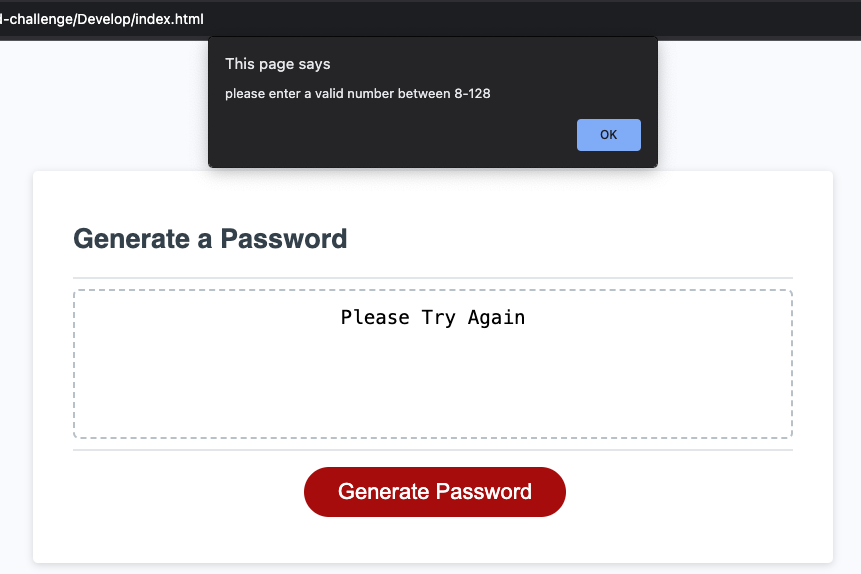

# Password Generator - Challenge

## Description

The Password Generator is meant to take in criteria set by the user for how long the password should be and what characters are used in it. Once all selections are made the password is printed onto the screen.

## Installation

N/A

## Usage

Once the red 'generate password' button is pressed the first prompt shows on the page asking how many characters long you would like the password to be. This is followed by 4 prompts about what characters they would and would not like to include out of lower case letters, uppercase letters, special characters and numbers. If the password length is out of the 8-128 range or if no character types are selected a 'Please Try Again' message is printed to the screen prompting the user to begin again with proper input. Then if all the input meets our requirements a password is printed to the page that meets the selected criteria.

[Live link to PSWD Generator]()

[Deployed Link](https://garrethil.github.io/random-password-generator/)

## Credits

N/A

## License

Please refer to the LICENSE in the repo.